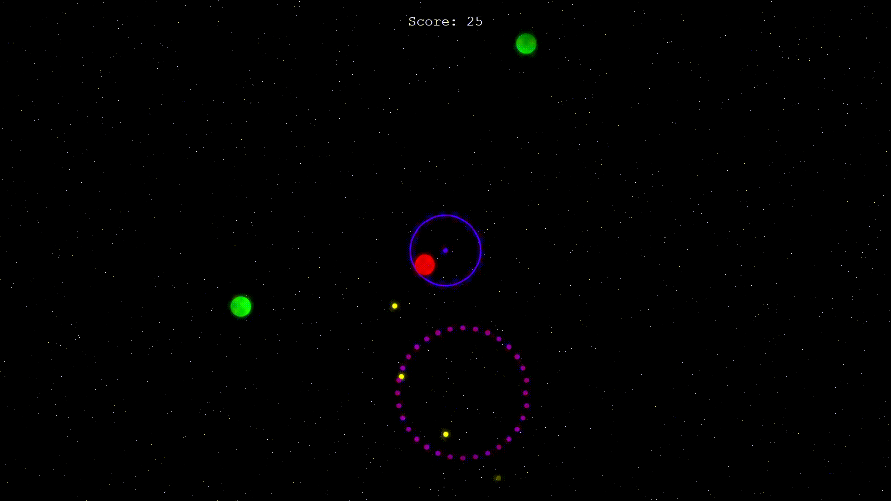

# Space Invaders
Ce jeu fait partie du projet DevOPs **Jeux Vidéops** d'Epitech.
Il est intégré dans une pipeline de CI (continuous integration).

Etudiante : Renaud Baussart & Alison Dehaies - Promo 2027

## Prérequis
* **Node.js** : version `18.x` (LTS Hydrogen)
* **Gestionnaire de paquets** : `npm` (inclus avec Node)


## Démarrer le jeu
``` npm install ```
```npm start ```

## Test
Vérifier la conformité du code et la logique mathématique :
**Linter (google style guide)**
```npm run lint```

**Tests unitaires (jest)**
```npm test```

## Infrastructure DevOps
**Bundler:** Parcel (compilation & assemblage)
**Test Runner:** Jest (Validation des fonctions mathématiques)
**CI:** GitHub Actions (pipeline automatisé)


Simple game made for [js13k](https://js13kgames.com/)

